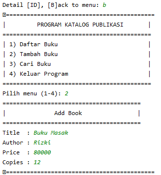

# 
 Penjelasan UAS

1. Lakukan fork pada repositori https://github.com/abuazzam/uaspy20 (Harus Login)

2. Lakukan clone repositori uas ke PyCharm atau ke Lokal, copy URL tersebut

3. Konfigurasi VCS Menggunakan Git

4. Kemudian paste URL repositori tadi

5. Daftar Buku adalah perintah yang memanggil fungsi list_book() pada Class BaseApp.

6. Tambah Buku adalah perintah yang memanggil fungsi add_book() , lalu hasil nya di tambahkan pada atribute books.

7. Cari buku untuk memanggil search_book() yang terdiri dari beberapa Class dan Method dengan atribute books

8. Keluar Program untuk break program